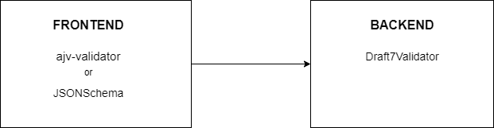
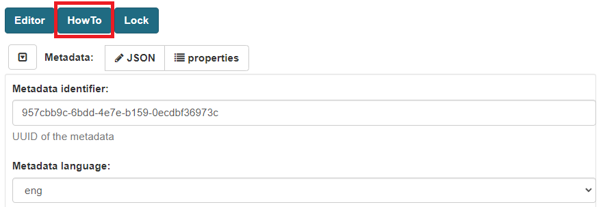
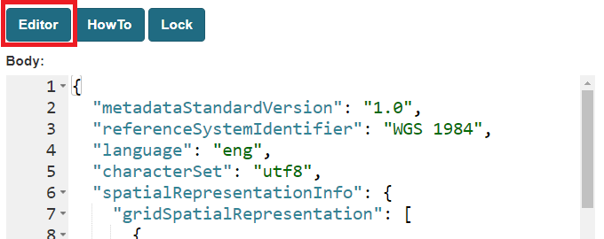
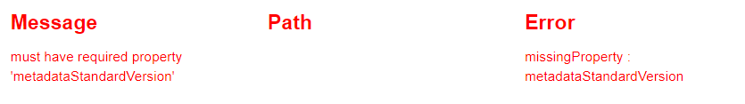

# ckanext-jsonschema

This plugin provide a quite extensive set of functionalities to introduce **jsonschema based metadata types** into CKAN  (>=2.8) metadata.

It also provide an **User Interface** (UI) based on the [json-editor](https://github.com/json-editor/json-editor) library to properly **edit** and **validate** complex json fields.
The UI can can also be customized in terms of components and autocompletion capabilities via javascript modules.

Provide an iso19139 implementation and a simplified profile and several types already implemented.

Provide several extension points to introduce new dataset and resource formats in other (json based) formats (f.e. STAC).


### How it works

Leveraging on the extra fields capabilities of CKAN, the jsonschema plugin is defining tree custom extra fields (predefined and fixed).

These will be used extensively for the definition of the content and behaviours of the types implemented by the jsonschema plugins 

These fields will be attached to the default domain objects of CKAN (datasets, resources and views) 

<!--TODO: Groups, Organizations-->

<!--TODO: show buttons under metadata/resources-->

Then main usage of this additions is to use json and json-schema to define models of domain objects which vary in complexity, on which the logic of each plugins works.

The body of jsonschema objects is commonly used as **single source of truth**, generating an **extraction** **flow** from the json to CKAN fields. 

The goal is to simplify the way a metadata mapping is performed in CKAN. 

This is quite useful and easy to implement when you need predefined indexing and mapping logic for any type of JSON.    

The jsonschema_iso plugin extensively use this approach.

<!-- TODO Describe jsonschema_type, jsonschema_body, jsonschema_opt (meta-metadata) -->

The **jsonschema_type** is a string field which identifies a specific jsonschema type. The type is then used widely in the plugin to referr to its configuration (see below: Registry)


### Views

From the jsonschema prospective, the view is the representation of the metadata. Each change in the metadata may be reflected into every view configured on it.

For example, changing the title or the description of the metadata, could cause a change in the appearance of the view.

For this reason we introduce for all the jsonschema views the concepts of Resolution and Wrapping, which utility is explained in the following paragraphs.

The terriajs plugin extensively use this approach.

Also, jsonschema introduces indexing for view: this is very useful to search views when creating complex and interconnected views.

**Resolution ** (TODO copy something from terria)

**Wrapping** (TODO)


## A closer look

### Extraction flow


### Importer:

The importer should be ready here:
https://{CKAN_URL}/jsonschema/importer

The url may return an XML iso, you can obtain one going over a geonetowrk metadata page and select donwload (top right) format xml

Example:

here is a metadata url (view)

https://{GEONETWORK_URL}/srv/eng/catalog.search#/metadata/{UUID}

Resulting xml will be (download):

    https://{GEONETWORK_URL}/srv/api/records/{UUID}/formatters/xml?approved=true

- destination format should be iso19139
- source format xml.
- organization: choose yours.

Metadata is imported as private or an error is reported.

The final result of the import will be automatically translated into a simplified iso metadata.

Please return json and url used.

Ref:
https://github.com/ckan/ckan/discussions/6364

### Validation

Dataset and resources are matched against JSON schema files to validate them.

The validations happens both at frontend and backend.





When the edit page is requested, the JSONEditor library fetches the JSONschema files necessary for the specific item that is being edited; it also resolves nested references in the schemas.


The user can use two different editors at frontend, provided by the library JSONschema, with two different validators.

If "HowTo" is selected (which is the default choice), a form is presented to the user. 

The form is automatically constructed using the  JSON schema file corresponding to what is being edited; the same schema is also used for the validation.




If the user switches to the "Editor" mode, then a vanilla editor pops-up, where the JSON can be directly edited.



For both approaches, the validation is executed when the value of any fields changes ("onchange" listener).


If there are validation errors, they are listed at the bottom of the page. Also, the confirm button is disabled, and if the error occured in the "Editor" mode, it is not possible to switch to "HowTo" mode without solving the errors beforehand.




When the validation is successfully, it is possible to use the confirmation button. Upon pressing the button, the form is disabled to prevent any change to the data before that the update is completed.

At this point, the request is sent to the backend, and validation also occurs on this side. If there are no errors, the process is completed; otherwise the page is reloaded and the errors are displayed on the top.


## Installation 

The jsonschema plugin comes with several plugins. To add their functionalities these must configured in the *ckan.plugins* property. 

The plugin which depend on jsonschema can be of two types; they can implement **metadata** (and resource) functionalities or **view** functionalities.


## SOLR

Add the following entry to the SOLR schema.xml:


```xml
<field name="res_ids" type="string" indexed="true" stored="true" multiValued="true"/>
<field name="res_jsonschemas" type="text" indexed="true" stored="true" multiValued="true"/>
<field name="res_jsonschema_types" type="string" indexed="true" stored="true" multiValued="true"/>
<field name="view_ids" type="string" indexed="true" stored="true" multiValued="true"/>
<field name="view_types" type="string" indexed="true" stored="true" multiValued="true"/>
<field name="view_jsonschema_types" type="string" indexed="true" stored="true" multiValued="true" />
<field name="view_jsonschemas" type="text" indexed="true" stored="true" multiValued="true" />
```

Optionally (will only work with the terriajs plugin)
```xml
<field name="bbox_area" type="float" indexed="true" stored="true" />
<field name="maxx" type="float" indexed="true" stored="true" />
<field name="maxy" type="float" indexed="true" stored="true" />
<field name="minx" type="float" indexed="true" stored="true" />
<field name="miny" type="float" indexed="true" stored="true" />

```


Tomcat9 sorl:

Due to relaxedQueryPath limits (https://tomcat.apache.org/tomcat-8.5-doc/config/http.html)
we need to properly setup the connector:
nano /etc/tomcat9/server.xml

Setup the connector as following:

```xml
<Connector port="8983" protocol="HTTP/1.1"
                   connectionTimeout="20000"
               redirectPort="8443" relaxedQueryChars="&quot;&lt;&gt;[\]^`{|}"
/>
```

see also:

    "&quot;&lt;&gt;![\]^`{|}"


## Plugins overview

| Plugin                  | Version  | Type     | Functionalities                                              |
| ----------------------- | -------- | -------- | :----------------------------------------------------------- |
| jsonschema              | Released | core     | This is the main plugin. It implements several actions related to jsonschema metadata, blueprints and Jinja helpers. It also implements the custom jsonschema indexing for SOLR. This plugin needs to be configured to use any of the following |
| jsonschema_iso          | Released | metadata | Adds support for the *iso* metadata format and for different custom resources |
| jsonschema_stac         | Alpha    | metadata | Adds support for the *stac* metadata format and for the *stac-asset* resource |
| jsonschema_dataset      | Released | metadata | Needed to integrate the jsonschema functionalities with the dataset metadata. It also adds the *JSON* custom resource |
| jsonschema_frictionless | Alpha    | metadata | Adds support for *Tabular Data* custom resource              |
| harvester_iso19139      | Alpha    | metadata | Harvester for iso19139 from GeoNetwork using CSW. Superseded by the importer |


## Related plugins

| Plugin                    | Version  | Type     | Functionalities | Ref                                                        |
| ------------------------- | -------- | -------- | :-------------- | ---------------------------------------------------------- |
| terriajs                  | Released | view     |                 | https://bitbucket.org/cioapps/ckanext-terriajs             |
| jsonschema_dashboard      | Released | metadata |                 | https://bitbucket.org/cioapps/ckanext-jsonschema-dashboard |
| jsonschema_dashboard_view | Released | view     |                 | https://bitbucket.org/cioapps/ckanext-jsonschema-dashboard |


## Plugins functionalities

Here are presented the operations supported at package level for each plugin

| Plugin             | Package type | Import | Extractor | Clone | Validate | Output |
| ------------------ | ------------ | ------ | --------- | :---- | -------- | ------ |
| jsonschema_iso     | iso19139     | Y      | N         | N     | N        | N      |
| jsonschema_iso     | iso          | N      | Y         | Y     | Y        | Y      |
| jsonschema_dataset | dataset      | N      | N         | Y     | N        | N      |
| jsonschema_stac    | stac         | N      | Y         | N     | Y        | Y      |


## Resource types

| Plugin             | Resource type           | Import | Extractor | Clone | Validate |
| ------------------ | ----------------------- | ------ | :-------- | ----- | -------- |
| jsonschema_iso     | Distributor             | Y      | Y         | Y     | Y        |
| jsonschema_iso     | Online Resource         | Y      | Y         | N     | Y        |
| jsonschema_iso     | Graphic Overview        | Y      | Y         | N     | Y        |
| jsonschema_iso     | Metadata Contact        | Y      | Y         | Y     | Y        |
| jsonschema_iso     | Resource Contact        | Y      | Y         | Y     | Y        |
| jsonschema_iso     | Maintainer              | Y      | Y         | Y     | Y        |
| jsonschema_iso     | Cited Responsible Party | Y      | Y         | Y     | Y        |
| jsonschema_dataset | Dataset resource        | N      | N         | Y     | N        |
| jsonschema_dataset | JSON Resource           | N      | Y         | Y     | Y        |
| jsonschema_stac    | Stac assset             | N      | Y         | N     | Y        |


## The Configuration

#### Schemas, Templates, Modules

Each type of jsonschema entity can have a corresponding:

- **schema**: which defines the schema of the object, using the json-schema framework (https://json-schema.org/)
- **template**: a json object which respects the json-schema definition and is used when a new instance is being created as a default value
- **module**: a javascript file which includes additional functionalities for the editor

The jsonschema plugin ships with schema, template and modules for the types that it implements. 

When CKAN starts, jsonschema reads these files and creates a in-memory catalog where they are stored.


Plugins that implement additional types should register their schemas, templates and modules into the jsonschema catalog (using the interfaces methods).

 

## The Registry 

The jsonschema plugin behaviours are driven by its **registry**.

Each plugin defining new types, may update the jsonschema's registry.

Each plugin  implementation can define its own registry.json to define its own types. 

(Ref to *add_to_registry* in tools.py)


The **registry.json** consists of a json whose entry are widely used into the jsonschema implementation.

For each entry:

- the key is the **jsonschema_type** which that configuration refers to (it can be referred to a **metadata**, **resource** or **view** type)
- the value is the configuration related to that type


An example entry is showed below:

```json
"iso": {
    "label": "Iso",
    "plugin_name": "jsonschema_iso",
    "schema": "iso/iso.json",
    "template": "iso/iso.json",
    "module": "iso/iso.js",
    "supported_jsonschema_fields": ["body", "opt"],
    "supported_ckan_fields": ["license_id", "owner_org"]
}
```


Most of the configurations are in common between metadatas, resources and views; some are reserved for views.

Below is a comprehensive list of possible values:

| Property Name                   | Type             | Usage                                                        |
| ------------------------------- | ---------------- | ------------------------------------------------------------ |
| label                           | String           | The label for the jsonschema_type. This is used in the CKAN UI's (for example, for resources it is the label shown in the dropdown) |
| plugin_name                     | String           | This is the name of the plugin that implements the entity. The plugin will be used when manipulating entities of this type |
| schema                          | String           | Path to the jsonschema for the type, relative to the main path of schemas |
| template                        | String           | Path to the template for the type, relative to the main path of templates |
| opt_schema                      | String           | Path to the jsonschema for the options, relative to the main path of schemas |
| opt_template                    | String           | Path to the template for the options, relative to the main path of schemas |
| module                          | String           | Path to the module for the type, relative to the main path of modules |
| supported_jsonschema_fields     | Array of Strings | List of jsonschema fields to display in the UI for that type. Possible values are: *body*, *opt* |
| supported_all_jsonschema_fields | Boolean          | If true, enables all jsonschema fields in the UI (overrides supported_jsonschema_fields) |
| supported_ckan_fields           | Array of Strings | List of default CKAN's fields to display in the UI for that type. Possible values are: <br />- for metadata: *title, url, custom, notes, tags, license_id, owner_org, author, maintainer, version* <br />- for resources: *name, description, format, url, metadata_fields*<br />- for views: *title, description, filters* |
| supported_all_ckan_fields       | Boolean          | If true, enables all default CKAN's fields in the UI  (overrides supported_ckan_fields) |
| skip_indexing                   | Boolean          | If true, the jsonschema fields of that metadata, resource or view will not be indexed into SOLR |

**Notes**

The field "plugin_name" is used to retrieve the instance of the plugin handling a type.

In case of views, this field is ignored, because CKAN retrieves itself the corresponding plugin for a view. 

It does this by calling the method "info" of plugins implementing the interface IResourceView. If the field "name" in the object returned by info mathces the field "view type" of the view, that plugin is considered to implement that view. 

Usually the name is set to match the name of the plugin for consistency.

Also for consistency, the field "plugin_name" is still added for entry regarding views in the registry. 


## View Configuration

The plugins implementing views must define their own configuration file (JSON).

This file allows having multiple view types (using jsonschema type) in the same plugin. The so created views will all have the same "view type" (the name of the plugin) but different jsonschema types (and behaviours).

At startup, they must load the configuration into the "config" attribute of the plugin object.

An example:

```python
def update_config(self, config_):
    ...
    self.config = json.loads(plugin.PATH_CONFIG, plugin.FILENAME_CONFIG)

```

The attribute "config" will then be accessed by the framework when needed.


An example configuration is:

```json
{
    "views": [
        {
            "view_jsonschema_type": ["wms"],
            "resource_formats": ["wms"],
            "available_for_all_resource_jsonschema_types": true,
            "skip_indexing": true,
            "default_view": true
        }
    ],
    "info": {
        "icon": "globe", 
        "title": "Map",
        "default_title":"Map",
        "always_available": false,
        "preview_enabled": false,
        "full_page_edit": true
    },
    "opt": {
        "base_url": "https://localhost/terriajs",
        "west": -180,
        "east": 180,
        "north": 90,
        "south": -90
    }
}
```

The configuration is based on 3 fileds:

- views: which define an array of views configurations (a "block" is a single entry of the array)
- info: which is used to set general configurations for all of the views of this plugin
- opt: which is a free JSON field, customizable with any desired object


List of possible attributes of the a "view" block:

| Property Name                               | Type            | Usage                                                        |
| ------------------------------------------- | --------------- | ------------------------------------------------------------ |
| view_jsonschema_type                        | Array of String | The array of view jsonschema types which match this block of configuration |
| resource_formats                            | Array of String | The resource formats to which this block of configuration applies |
| resource_jsonschema_type                    | Array of String | The resource jsonschema type to which this block of configuration applies |
| available_for_all_resource_formats          | Boolean         | If true, skips then check on the format of the resource      |
| available_for_all_resource_jsonschema_types | Boolean         | If true, skips then check on the jsonschema type of the resource |
| default_view                                | Boolean         | If true, the view is automatically created when adding/updating the resource (according to CKAN's logic) |
| skip_indexing                               | Boolean         | If true, skips any custom logic for indexing the view (the view is still indexed) |

**Notes**

CKAN defines the interface IResourceView for plugin managing views. All plugin implementing IJsonschemaView must also implement IResourceView.

*Can view*

CKAN uses the interface method "can_view" to decide wether a plugin must manage a specific type of view. 

For example, when showing the dropdown "Add view", CKAN calls the method "can_view" of each plugin implementing IResourceView. If the result value is true, the view type corresponding to that plugin is added to the dropdown.

*Can View (IJsonschema)*

The jsonschema approach allows each view plugin to implement multiple types of views. These are identified by the jsonschema type.

A plugin "can view" with respect to a resource if there exists a configuration block for the pair (resource format, resource jsonschema type).

For example, based on the example configuration above, if there is a resource of format "wms" and jsonschema type "online-resource", the "can view" method returns true, because there exists a matching configuration.

If there is a resource of format "wms" and jsonschema type "json_resource", the "can view" method still returns true, because a wildcard is used for the jsonschema type of the resource.

On the other hand, if the resource has format "csv", the "can view" method returns false, because there is no matching configuration.

*View Jsonschema Type*

If there is a matching configuration block for a resource, each of the view types listed in the field "view_jsonschema_type" can be added, edited and viewed.

For each one of those, there should be a corresponding entry in the registry.

*Default View*

If "default_view" is set to true, the will be created a view with the type of the first entry in the filed "view_jsonschema_type".

*View type and jsonschema type*

The default CKAN approach allows a plugin to implement only one type of view. The type of the view is stored in the field "view_type".

With jsonschema, the "view_type" is usually set to be the name of the plugin.

Then, in the view configuration there is the field "jsonschema_type".

This allows a plugin to implement different views, each with the same view type, but different jsonschema type.


## The Registry
To get a list of acceptable schema_type check out the keys from this map:

    https://{CKAN_URL}/jsonschema/registry

### Registry lazy load

Some of the startup operations in CKAN are performed just after the setup of a plugin for this reason there's a lazy load mechanism which will perform some operations when required the first time from the api (f.e. load the list of registry entries).

### License

The Jsonschema plugin overtakes the license field for packages supported by plugins that use Jsonschema.

CKAN's default license field is hidden, and it has to be included into the schema of the package.
To be able to validate the license entry against the list of licenses loaded by CKAN, the list of licenses is materialized as a JSON so that it can be referenced in schemas.

This is done lazily when the file is needed for the first time. 
The file is written at PATH_SCHEMA/PATH_CORE_SCHEMA (default is schema/core/), so the process MUST have permission to write at PATH_SCHEMA, otherwise the startup will file (the creation of subpaths is managed by the code).

##### Schema example
`
"license_id": {
​   "propertyOrder": 1,
​   "title": "License",
​   "type": "string",
​   "$ref": "core/licenses.json"
}`

##### Note

Starting from CKAN 2.8.9 it should be possible to create the file at the startup, so the lazy machinery could be removed.


# API

## Body, Type, Opt

These are GET and sideffect free calls which can be used to inspect the content of the fields controlled by the 

    https://{CKAN_URL}/jsonschema/{body|type|opt}/{PACKAGE_ID}[/{RESOURCE_ID}[/{VIEW_ID}]]

## View specific params

When you have a view based on the jsonschema plugin you may (it depends on the specific implementation) have some additional arguments
available:

https://{CKAN_URL}/jsonschema/{body|type|opt}/{PACKAGE_ID}/{RESOURCE_ID}/{VIEW_ID}

To understand the following optional parameter we may describe the concept of item and the resolution:

### wrap

A view can be based on a composition of existing views, and you may want to compose them into a single big collection.

The Main view configuration (jsonschema_body of the view) for this reason some time could be something which is not usable directly by the viewer (normally an Iframed application which will receive our json as configuration).

For this reason we call each jsonschema_type of a view an **item** which can be composed (optionally) with other items into a **config**.

The logic is not implemented by the jsonschema but should be provided by the implementing view plugin as it could be different for each view.

But the concept is quite common (we have two plugins implementing it, one of them is the publicly available terriajs plugin) and can be shared and reused by the api.

So a **config** can be:

```json

{
    "catalog":[
        {
            "type":"jsonschema_type_1"
        },
        ...
        {
            "type":"jsonschema_type_n"
        }
    ]

}

```

While the **item** is:

```json
{
    "type":"jsonschema_type_1",
    "other": "stuff"
}
```

In short wrap=true is a simple whay to ask to the implementing plugin to return a **config** (potentially dynamically generated) starting from an **item**

So if your view is defining an **item** and the url is the following:

    https://{CKAN_URL}/jsonschema/body/{PACKAGE_ID}/{RESOURCE_ID}/{VIEW_ID_OF_THE_ITEM}

To obtain a config to pass to your application viewer you may pass:

    https://{CKAN_URL}/jsonschema/body/{PACKAGE_ID}/{RESOURCE_ID}/{VIEW_ID_OF_THE_ITEM}?wrap=true

Which may wrap the view (body) of the **item** you are referring to into a fake or dynamically generated **config** that your application will recognize as valid.

Obviously all of the above is totally optional if the implementing plugin and the viewer do not need to group items.

This is instead largely used by the terriajs and the Dashboard plugins.

### resolve

The resolve option is instead core to the plugin view and some functionnalities are provided out of the box from into the **view_tools** so an implementing plugin can easily leverage on it.

The base concept is that a view may represent the metadata and the resource and the configuration shipped by the view may be havely based on those data models.

So jsonschema plugin is providing a model (available in the view interface clicking the **model** button) to interpolate values from the package, resource and organization on the fly.

This is quite usefull when an user changes the title of the metadata or the resource where a view is defined, at that point if the view is using the model as placeholder the change is automatically reflected into the view.

For example if a view jsonschema_body contains:

```json
{
    "name":"{{resource.name}}",
    "description": "{{package.notes or resource.description}}"
}
```

Using the resolve=true parameter the expected returned body will be:

    https://{CKAN_URL}/jsonschema/body/{PACKAGE_ID}/{RESOURCE_ID}/{VIEW_ID_OF_THE_ITEM}?resolve=true


```json
{
    "name":"The name of the resource",
    "description": "The description of the package (or the one from the resource)"
}
```

### force_resolve

Thanks to the jsonschema plugin a view is now also indexed into solr and it is used to provide a fast way to return an already resolved view body.

Every time you change a view based on the jsonschema view the package with all the resources and all the views will be reindexed

To enforce the resolution of an already resolved view, use this parameter.

### Acceptable params:
|Param|Type|Note|Example|
|--|--|--|--|
| wrap | Boolean | Is used to provide a defaul wrapping structure when the item is not the first  | resolve=False |
| resolve | Boolean |  | resolve=True |
| force_resolve | Boolean |  | force_resolve=True |


## View Search

    https://{CKAN_URL}/api/action/jsonschema_view_search?view_type={VIEW_TYPE}

This api will try to return and match all the jsonschema based VIEWS indexed into solr

It will only query for Public metadata
 
### Request type:
	
GET

### Mandatory params:
|Param|Type|Note|Example|
|--|--|--|--|
| view_type | String | the plugin name which manage the view. currently only | jsonschema_dashboard_view, terriajs |

### Acceptable params:
|Param|Type|Note|Example|
|--|--|--|--|
| query | String | Full-text search through all the text fields |  |
| package_desc | String |  |  |
| package_name | String |  |  |
| package_title | String |  |  |
| resource_desc | String |  | "my description" |
| resource_name | String |  |  |
| tags | String or Array | List of dataset tags to search for | (food farm rice) |
| data_format | String | Filter resources by format (wms, csv, json etc.) |  |
| organization_name | String |  |  |
| join_condition | String | [OR|AND default is AND] | AND |
| schema_type | String | the schema used for the view body it should match with the schema key of the registry, see below |  |
| max_package_number | Number | Default is 100. There's an hard limit to 1000 packages (which can generate a huge list of views, several for each package) it can be reduced using this parameter | 99 |


### Response:
|Param|Type|Note|Example|
|--|--|--|--|
| package  | String | Package metadata information: id, name, title, description, license_id/license_title, tags, author, maintainer, creator_user_id |  |
| organization  | String | Organization metadata: id, name, title, description |  |
| package_id  | String | ID of the package |  |
| resource_id  | String | ID of the resource |  |
| view_id  | String | ID of the view |  |
| metadata_link  | String (url) | WEB page url |  |
| resource_link  | String (url) | WEB page url |  |
| jsonschema_body_link | String (url) | REST API |  |
| view_type  | String | may match the **type** parameter | terriajs |
| jsonschema_body | String (Json) | Resolved view body | {"key":"value"} |
| jsonschema_type | String | may match the schema used from the registry, see below | wms |
| jsonschema_opt | String (Json) | meta-metadata optional informations, should never be exposed but can ship some hints |  |

**Notes:**
 - In case of spaces values please quote the string with "value with spaces"
 - In case of full you could try to use star notation but it's not guarantee a full text search (f.e.: "*value with *")


## View List

    https://{CKAN_URL}/api/action/jsonschema_view_list?package_id={VIEW_TYPE}

This api will try to return all the jsonschema based VIEWS indexed into solr from a specific package

It will only query for Public metadata
 
### Request type:
	
GET

### Mandatory params:
|Param|Type|Note|Example|
|--|--|--|--|
| package_id  | String | The ID or the Name of the package |  |

### Response:
|Param|Type|Note|Example|
|--|--|--|--|
| package_id  | String | ID of the package |  |
| resource_id  | String | ID of the resource |  |
| view_id  | String | ID of the view |  |
| metadata_link  | String (url) | WEB page url |  |
| resource_link  | String (url) | WEB page url |  |
| jsonschema_body_link | String (url) | REST API |  |
| view_type  | String | may match the **type** parameter | terriajs |
| jsonschema_body | String (Json) | Resolved view body | {"key":"value"} |
| jsonschema_type | String | may match the schema used from the registry, see below | wms |
| jsonschema_opt | String (Json) | meta-metadata optional informations, should never be exposed but can ship some hints |  |

**Notes:**
 - In case of spaces values please quote the string with "value with spaces"
 - In case of full you could try to use star notation but it's not guarantee a full text search (f.e.: "*value with *")


### Geospatial search:

Yes we have also bbox indices fetched directly from wms services... (provided by terriajs view plugin) but we are still not able to use the BBOX parameters which are in solr.
TODO we planned to change the solr bbox index leveraging on solr > 4.x


## Clone (webpage)

    https://{CKAN_URL}/jsonschema/clone

## Importer (webpage)

    https://{CKAN_URL}/jsonschema/importer

## Validate (webpage)

    https://{CKAN_URL}/jsonschema/validate


## Registry

Returns all the available (registered) jsonschema types

    https://{CKAN_URL}/jsonschema/registry[/jsonschema_type]
 
### Request type:
	
GET

## Schema, template and javascript modules

For each registry entry you may want to retrieve the **schema**, the **template** or the **javascript modules**

    https://{CKAN_URL}/jsonschema/{schema|template|module}/jsonschema_type_path.{json|js}

The javascript **module** is loaded into the interface and can be used to provide autocompletion for a specific jsonschema_type and for several othe extensions point (ref to the json-editor library for a list)

The **template** is used to populate an empty type when it is created

The **schema** is the jsonschema definition of the associated type


### Request type:
	
GET


# Extend jsonschema


## Base concepts
The jsonschema plugin acts as a framework. It defines two interfaces. When needed, it searches for plugins implementing those interfaces and calls the appropriate implementations.

The interfaces define default behaviours so that plugins that don't need every functionality don't have to implement every method.

The interfaces are **IBinder** and **IJsonschemaView**.

Plugins that want to implement package/resource level functionalities should implement IBinder; plugins that want to implement view level functionalities should implement IJsonschemaView. It should be possible for a plugin to implement both.

## IBinder

IBinder defines two important classes of methods.

For each operation, there is a method which should return a list of all of the types implemented by the plugin for that operation.

Then, for each operation there is a method that takes a specific type and returns a method that handles that operation for that type. The method is then called by the framework at appropriate times.

**An example:**

```python
def get_input_types(self):
	return list of types supported in input

def get_input_extractor(self, package_type, package_dict, context):
    return method for input operation of package type
```

The default implementation is to define a map for each operation, where the keys are the types supported for that operation and the values are the implementations.

### Important notes

For each type defined by these methods there should be a corresponding entry in the registry, defining some properties for the type.

Note that when we have to retrieve a list of types, these methods will be used (not the registry).

E.g., when adding a resource, the list of resources type is compiled calling the appropriate methods from the plugins.
Once a resource type has been selected, some behaviors are driven by the entry in the registry (e.g. retrieving the correct jsonschema and template).

## Extraction flow

The plugin inherits the interface **IDatasetForm** and overrides the actions *create_package_schema* and *update_package_schema* to validate and convert data coming from users.

It adds 4 methods that are executed in the order in which they are introduced below:

- *schema_check*: this method uses the Draft7Validator to validate the data against the appropriate JSONSchema. If the validation is unsuccessful, the process stops here.

The next 3 methods call methods of the plugin which manages the specific format, so that it can add its custom implementation :

- *before_extractor*: calls the plugin's implementation *before_extractor*. Can be used as preprocessing step

- *extractor*: calls the plugin's implementation of *extract_from_json*. Create the data model from the incoming body, modifying the body in a UI suitable form

- *resource_extractor*: for each item in the field "resources" of the data, calls the method *extract_from_json* passing the specific resource type. Plugins should check the type passed in to choose the right implementation to use

## IJsonschemaView

The IJsonschemaView should be implemented by plugins implementing view level functionalities

## Setting up the plugins

No special operation should be performed to setup a plugin, these operations are performed via python methods so a jsonschema plugin will be able to auto configure itself.

Both **IBinder** and **IJsonschemaView** are declaring the method *register_jsonschema_resources*.

This method is called by the jsonschema framework at startup time (see lazy load), and each plugin should implement here the logic needed to enrich the *catalog* and the *registry*.

### Populate the catalog

The default mechanism is to store the files at:

    {plugin_source_folder}/setup/[schema|template|module]/{plugin_name}

and then use the tools provided by Jsonschema to enrich the catalog.

Please reference to the functions  in **tools.py**:
 - add_schemas_to_catalog
 - add_templates_to_catalog
 - add_modules_to_catalog

### Populate the registry

The default mechanism is to store a registry specific for the plugin at 

    {plugin_source_folder}/public/registry.json

and then use the tools provided by Jsonschema to enrich the registry.

Please reference to the function in tools.py:
- add_to_registry

A basic implementation is:

```python
def register_jsonschema_resources(self):
    tools.add_schemas_to_catalog(plugin.PATH_SCHEMA)
    tools.add_templates_to_catalog(plugin.PATH_TEMPLATE)
    tools.add_modules_to_catalog(plugin.PATH_MODULE)
    tools.add_to_registry(plugin.PATH_REGISTRY, plugin.FILENAME_REGISTRY)
```

### Helpers

The jsonschema plugin define several helpers to be used in Jinja templates.

| Helper Name                                                | Descriptiom                                                  |
| -- | -- |
| jsonschema_as_json                                         | Dumps the content of a dict to a JSON                        |
| jsonschema_get_package_body                                | Returns the body of a package                                |
| jsonschema_get_package_type                                | Returns the type of a package                                |
| jsonschema_get_package_opt                                 | Returns the opt of a package                                 |
| jsonschema_get_resource_body                               | Returns the body of the resource                             |
| jsonschema_get_resource_type                               | Returns the type of the resource                             |
| jsonschema_get_resource_opt                                | Returns the opt of the resource                              |
| jsonschema_get_view_body                                   | Returns the body of the view                                 |
| jsonschema_get_view_type                                   | Returns the type of the view                                 |
| jsonschema_get_view_opt                                    | Returns the opt of the view                                  |
| jsonschema_url_quote                                       | Quote a URL string                                           |
| jsonschema_is_jsonschema_view                              | Returns true if the view is managed by a jsonschema plugin   |
| jsonschema_get_configured_jsonschema_types_for_plugin_view | Returns the available jsonschema types for the given view    |
| jsonschema_get_view_info                                   | Returns the info from the plugin of the view                 |
| jsonschema_get_rendered_resource_view                      | Returns a rendered resource view snippet.                    |
| jsonschema_get_schema                                      | Returns the jsonschema for a type                            |
| jsonschema_get_template                                    | Returns the template for a type                              |
| jsonschema_get_opt                                         | Returns the defaults opt                                     |
| jsonschema_handled_resource_types                          | Returns a list of supported resource types                   |
| jsonschema_handled_dataset_types                           | Returns a list of supported package types                    |
| jsonschema_handled_input_types                             | Returns a list of supported import package types             |
| jsonschema_handled_output_types                            | Returns a list of supported output package types             |
| jsonschema_get_label_from_registry                         | Get the label from the registry for a type                   |
| jsonschema_is_supported_ckan_field                         | Check if the CKAN input field is configured as visible in the type config |
| jsonschema_is_supported_jsonschema_field                   | Check if the jsonschema input field is configured as visible in the type config |


# ISO (iso19139)

The jsonschema plugin ships with it the plugin **jsonschema_iso**

These plugins add the capability to manage the iso19139 standard.

In particular, these provide a mapping from the iso19139 standard to CKAN entities. Also, these are integrated with the importer functionality so that iso19139 metadata can be fetched from the origin, converted into a structure manageable by CKAN, and imported into the CKAN instance.


The original source format (usually Geonetwork metadata) is an XML in the Iso19139 standard.


Because retrieving relevant data from the XML to import them directly into CKAN is quite tedious, an intermediate step is performed.


The original XML is mapped into the "iso" profile, which is just the JSON representation of the original XML. Then, the "iso" profile is mapped into CKAN's packages and resources and imported into the system.

The "iso" profile JSON is kept into the package's jsonschema_body extra field.


### Wayback

Even if it is not recommendable, a metadata that was an Iso19139 XML at the source and was then imported into CKAN, can be exported back into the original format (for example, a metadata can be imported into CKAN, edited and then exported back into standard XML).


This is provided by the wayback functionality. Please notice that, even if efforts were put to make this possible, the mapping between the standards is not complitely bijective and so the export could result a little different from the original version.