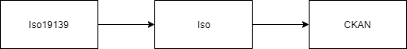

# JSONSCHEMA ISO

The jsonschema plugin ships also with the plugins jsonschema_iso and jsonschema_iso19139.

These plugins add the capability to manage the iso19139 standard.

In particular, these provide a mapping from the iso19139 standard to CKAN entities. Also, these are integrated with the importer functionality so that iso19139 metadata can be fetched from the origin, converted into a structure manageable by CKAN, and imported into the CKAN instance.

The original source format (usually Geonetwork metadata) is an XML in the Iso19139 standard.

Because retrieving relevant data from the XML to import them directly into CKAN is quite tedious, an intermediate step is performed.

The original XML is mapped into the "iso" profile, which is just the JSON representation of the original XML. Then, the "iso" profile is mapped into CKAN's packages and resources and imported into the system.

The "iso" profile JSON is kept into the package's jsonschema_body extra field.

### Wayback 

Even if it is not recommendable, a metadata that was an Iso19139 XML at the source and was then imported into CKAN, can be exported back into the original format (for example, a metadata can be imported into CKAN, edited and then exported back into standard XML).

This is provided by the wayback functionality. Please notice that, even if efforts were put to make this possible, the mapping between the standards is not complitely bijective and so the export could result a little different from the original version.
